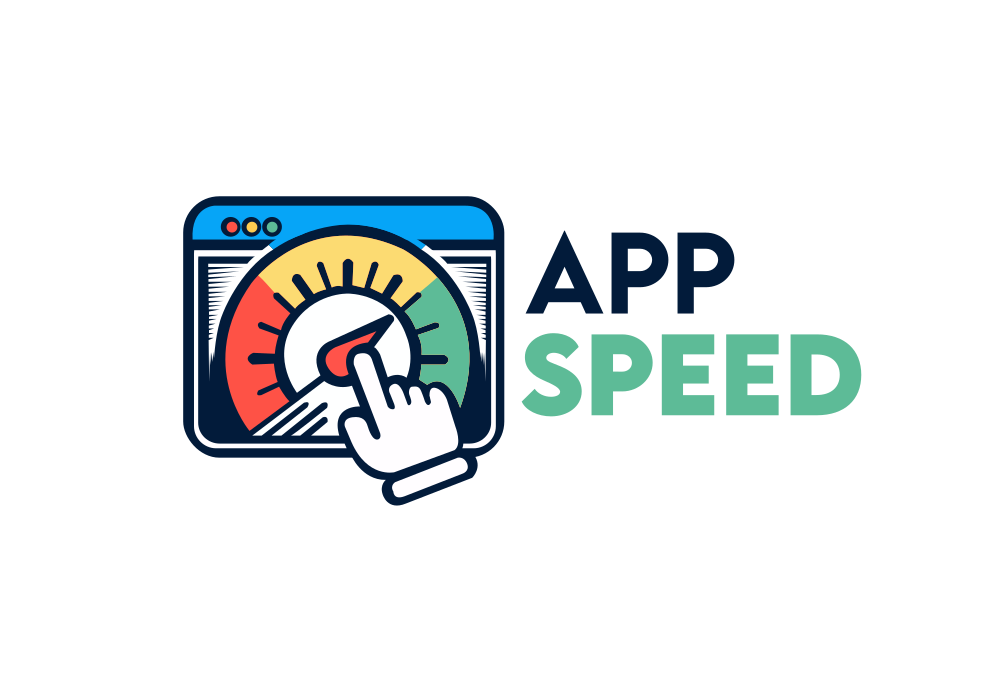

<h1 align="center">AppSpeed - Web Application Performance Insight</h1>
<h3 align="center">Go beyond initial load. Measure the performance users actually experience.</h3>
<p>
    
</p>

## Current Architecture

- `apps/portal`: thin Angular application shell and route composition.
- `apps/api`: Effect-based API control plane.
- `apps/runner`: thin runner entrypoint and deployment target.
- `libs/audit/**`: audit domain code shared across portal, API, runner, contracts, model, and persistence.
- `libs/platform/**`: cross-cutting platform services such as observability.
- `libs/ui/**`: reusable web UI primitives.

## Effect diagnostics (per Nx project)

This workspace provides an Nx target to run `@effect/language-service` diagnostics per project.

Run diagnostics for a single library:

```bash
pnpm exec nx run <project-name>:effect:diagnostics
```

Example:

```bash
pnpm exec nx run platform-observability:effect:diagnostics
```

Emit JSON (useful for machine processing or sharing with Codex):

```bash
pnpm exec nx run platform-observability:effect:diagnostics --format=json --outputFile=.tmp/effect/obs.json
```

Run diagnostics for multiple libraries:

```bash
pnpm exec nx run-many -t effect:diagnostics --projects=platform-observability,audit-persistence,audit-runner --parallel=3
```

## Angular Publishable Libraries

For publishable Angular libraries with secondary entry points, keep the root package name, `tsconfig.base.json` aliases, and consumer imports in the same canonical form.

Reference:

- [docs/conventions/angular-secondary-entry-points.md](docs/conventions/angular-secondary-entry-points.md)
