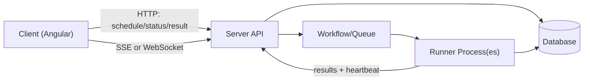

# Design Document: User Flow Audit Feature

Status: Draft
Owner: Christopher Holder
Last Updated: 2026-02-06

## Summary
This document defines the architecture for scheduling user flow audits, executing them on runners, and streaming progress back to the client. It targets a local-first developer experience while supporting production runners hosted on EC2 that can be started and stopped on demand. This is the primary design doc for the User Flow Audit feature.

## Goals
- Allow a user to submit an audit and receive a unique audit/run id.
- Provide real-time progress updates that include queue position and run status.
- Execute audits in a separate runner process locally and on EC2 in production.
- Store audit inputs, status, and results in the database.
- Keep the client insulated from direct runner communication.

## Non-Goals
- Multi-tenant authorization, billing, or quota policies.
- UI design details beyond API contracts and event shapes.
- Full autoscaling policies across multiple EC2 instance pools.

## Current State
- `apps/server` is an Effect-based API server with a basic audit queue and SSE endpoint.
- `libs/server/db` provides audit templates, runs, results, and a `claimNextRun` DB transaction.
- `apps/runner` runs a loop to claim audits from the DB queue and write results back to the DB.
- The NestJS conductor has been removed in favor of the Effect server API.

## Proposed Architecture
The system is split into a control plane (server) and one or more runners. The server owns scheduling, progress reporting, and the API contract. Runners execute audits and report results. A queueing/orchestration layer coordinates work and supports queue-position updates.



## Orchestration Approach
Effect Workflows + Effect Cluster are the accepted orchestration choice.

### Effect Workflows + Effect Cluster
- The server hosts the workflow runtime and schedules an `AuditRunWorkflow` per audit.
- Effect Cluster provides worker discovery and task distribution.
- Runners register as cluster workers and execute workflow tasks.
- Workflow events are persisted and emitted to clients via SSE or WebSocket.
- This provides durability, retries, and observability with minimal bespoke queue logic.

## Core Data Model
These types already exist in `libs/server/db` and align with the required flow.

- `AuditTemplate` stores the audit definition.
- `AuditRun` tracks status and timestamps.
- `AuditResult` stores the final output or error.

Supported status values:
- Run status: `SCHEDULED`, `IN_PROGRESS`, `COMPLETE`.
- Result status: `SUCCESS`, `FAILURE`.

## API Contracts
All client communication is HTTP, with SSE or WebSocket for progress. This keeps the browser API simple and is easy to use from Angular.

### Submit Audit
- `POST /api/audit/schedule`
- Request body: `ReplayUserflowAudit`.
- Response: `{ auditId, auditQueuePosition }`.

### Status + Result
- `GET /api/audit/:id` returns `{ status }`.
- `GET /api/audit/:id/result` returns `{ status, result }` when complete.

### Progress Stream (SSE)
- `GET /api/audit/:id/events` returns `text/event-stream`.
- Events include queue position and lifecycle status.
- Sample event shape:

```text
event: position
data: {"runId":"abc","position":2}

event: status
data: {"runId":"abc","status":"IN_PROGRESS"}

event: result
data: {"runId":"abc","status":"SUCCESS"}
```

## Queue Position Semantics
Queue position should be stable and derived from the durable queue, not in-memory data.

- The position is the count of `SCHEDULED` audits ahead of the run, ordered by `createdAt`.
- When a run moves to `IN_PROGRESS`, it is no longer counted in the queue.
- SSE should emit a new `position` event whenever the count changes.
- Queue position must remain consistent regardless of the number of active runners.

## Runner Lifecycle
The runner lifecycle is managed by a `RunnerManager` interface with local and AWS-backed implementations.
The system must support multiple concurrent runners while still operating correctly with a single runner.

### Local
- The server starts a runner process when the first audit is scheduled.
- The runner exits after it drains the queue or after a 1 minute idle timeout.
- The runner uses the same API as production to keep behavior aligned.

### EC2
- The server starts a stopped EC2 instance when the queue transitions from empty to non-empty.
- Runners register with the server and begin processing.
- When the queue is empty for 1 minute, the runner self-terminates or the server shuts it down via the AWS SDK.

## Runner to Server Communication
The runner needs a controlled interface to claim work and report results.

### Recommended (Workflows + Cluster)
- The runner is a workflow worker and executes tasks assigned by the workflow runtime.
- The workflow runtime persists state and handles retries.

### Direct DB Access (Production)
- Runners may have direct DB access in production for reading templates and writing results when appropriate.
- The server remains the control plane for scheduling and status visibility.

## Frontend Integration
The Angular app uses HTTP for submission and SSE for status updates.

- Schedule: HTTP `POST /api/audit/schedule`.
- Progress: SSE `GET /api/audit/:id/events`.
- Result: HTTP `GET /api/audit/:id/result`.

## Failure Handling
- Runner crash: runs remain `SCHEDULED` or `IN_PROGRESS` and can be reclaimed after a timeout.
- Duplicate results: `completeRun` should be idempotent for a run id.
- Workflow retries: when using Effect Workflows, failures and retries are automatic.

## Observability
- Emit structured logs for schedule, claim, start, complete, failure.
- Track queue depth, average wait time, and runner idle time.
- Provide trace ids in SSE/WebSocket events.

## Security
- Runner endpoints must be authenticated with a shared secret or mTLS.
- Server endpoints should validate audit schemas and enforce rate limits.

## Implementation Plan
Phase 1 focuses on stability and local-first flow. Phase 2 introduces EC2 lifecycle and workflow-backed multi-runner operation.

### Phase 1
- Align on a single control-plane API in `apps/server`.
- Remove NestJS conductor endpoints and migrate portal clients to `apps/server`.
- Implement SSE progress based on workflow/DB-backed queue position.
- Wire `apps/runner` as a workflow worker in local-first mode.

### Phase 2
- Add `RunnerManager` with AWS EC2 lifecycle support.
- Add idle-timeout shutdown.
- Expand Effect Cluster deployment for multiple runners.
- Support multiple runners and concurrent claims.

## Decisions
- This is the primary design doc for the User Flow Audit feature; additional docs may be created for deep dives.
- We will fully migrate away from NestJS and move portal clients to `apps/server` endpoints.
- Runners can have direct DB access in production.
- Idle timeout is 1 minute.
- The system must support multiple runners and still work with a single runner.
- SSE is the only client progress channel.
