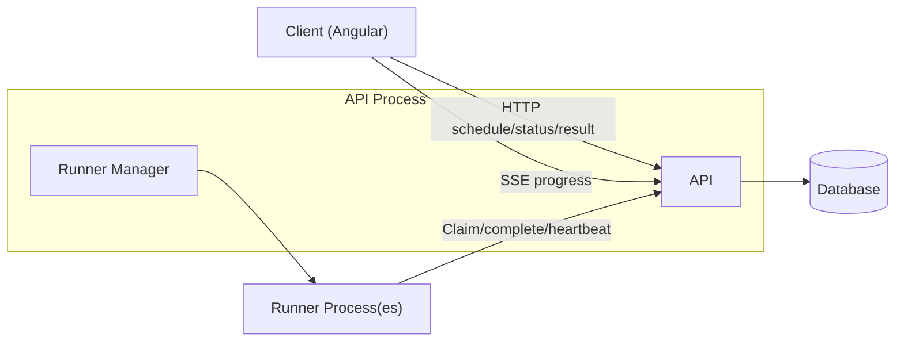

# Design Document: User Flow Audit Feature

Status: Draft
Owner: Christopher Holder
Last Updated: 2026-02-10

The feature we are designing is the User Flow Audit feature.
This document is the main design doc for the feature.

## Summary

This document defines the architecture for scheduling user flow audits, executing them on separate runner processes, and streaming progress back to the client. It targets a local-first developer experience while supporting production runners hosted on EC2 that can be started and stopped on demand. The API is the control plane, and runners pull work from the API over HTTP.

## Goals

- Allow a user to submit an audit and receive a unique audit/run id.
- Provide real-time progress updates that include queue position and run status.
- Execute audits in a separate runner process locally and on EC2 in production.
- Store audit inputs, status, and results in the database.
- Keep the client insulated from direct runner communication.

## Non-Goals

- Multi-tenant authorization, billing, or quota policies.
- UI design details beyond API contracts and event shapes.
- Full autoscaling policies across multiple EC2 instance pools.

## Current State

- `apps/api` is an Effect-based API app with a basic audit queue and SSE endpoint.
- `libs/server/db` provides audit templates, runs, results, and a `claimNextRun` DB transaction.
- `apps/runner` currently claims audits from the DB queue; this will move to API calls.

## Proposed Architecture

The system is split into a control plane (API) and one or more runners. The API owns scheduling, progress reporting, and the API contract. Runners execute audits and report results. A `RunnerManager` service ensures a runner is active when work exists.



## Orchestration Approach

Pull-based runner orchestration with a dedicated `RunnerManager`.

- Runners are separate processes (local) or separate hosts (production).
- The API starts a runner when the queue transitions from empty to non-empty.
- Runners call the API to claim work, report results, and send heartbeats.
- Each runner processes one audit at a time to avoid result variability.

## Core Data Model

These types already exist in `libs/server/db` and align with the required flow.

- `AuditTemplate` stores the audit definition.
- `AuditRun` tracks status and timestamps.
- `AuditResult` stores the final output or error.
- `Runner` tracks active runners and heartbeats.

Supported status values:

- Run status: `SCHEDULED`, `IN_PROGRESS`, `COMPLETE`.
- Result status: `SUCCESS`, `FAILURE`.

## API Contracts

All client communication is HTTP, with SSE for progress. This keeps the browser API simple and is easy to use from Angular.

### Submit Audit

- `POST /api/audit/schedule`
- Request body: `ReplayUserflowAudit`.
- Response: `{ auditId, auditQueuePosition }`.

### Status + Result

- `GET /api/audit/:id` returns `{ status }`.
- `GET /api/audit/:id/result` returns `{ status, result }` on success.
- `GET /api/audit/:id/result` returns `{ status, error }` on failure, where `error` includes `name`, `message`, and `stack`.

### Progress Stream (SSE)

- `GET /api/audit/:id/events` returns `text/event-stream`.
- Events include queue position and lifecycle status.
- Sample event shape:

```text
event: position
data: {"runId":"abc","position":2}

event: status
data: {"runId":"abc","status":"IN_PROGRESS"}

event: result
data: {"runId":"abc","status":"SUCCESS"}
```

## Queue Position Semantics

Queue position should be stable and derived from the durable queue, not in-memory data.

- The position is the count of `SCHEDULED` audits ahead of the run, ordered by `createdAt`.
- When a run moves to `IN_PROGRESS`, it is no longer counted in the queue.
- SSE should emit a new `position` event whenever the count changes.
- Queue position must remain consistent regardless of the number of active runners.

## Runner Lifecycle

The runner lifecycle is managed by a `RunnerManager` interface with local and AWS-backed implementations.
The system must support multiple concurrent runners while still operating correctly with a single runner.

Each runner processes exactly one audit at a time to prevent result variability.

Motivation: Lighthouse warns against concurrent runs on the same machine due to resource contention. See [Lighthouse variability guidance](https://github.com/GoogleChrome/lighthouse/blob/main/docs/variability.md#run-on-adequate-hardware).

> DO NOT collect multiple Lighthouse reports at the same time on the same machine. Concurrent runs can skew performance results due to resource contention. When it comes to Lighthouse runs, scaling horizontally is better than scaling vertically (i.e. run with 4 n2-standard-2 instead of 1 n2-standard-8).

### Local

- The API starts a runner process when the first audit is scheduled.
- The runner exits after it drains the queue or after a 1 minute idle timeout.
- The runner uses the same API as production to keep behavior aligned.
- The local `RunnerManager` uses Effect `Command` + `CommandExecutor` to spawn the runner process.
- Accepted dev spawn: `pnpm exec nx execute runner`.

### EC2

- The API starts a stopped EC2 instance when the queue transitions from empty to non-empty.
- Runners register with the API and begin processing.
- When the queue is empty for 1 minute, the runner self-terminates or the API shuts it down via the AWS SDK.

## Runner to API Communication

The runner needs a controlled interface to claim work and report results.

### Runner API (HTTP)

- `POST /api/runner/claim` requests the next audit. The API returns the next `AuditRun` payload or an empty response when no work exists.
- `POST /api/runner/complete` submits the final result or error for an audit.
- `POST /api/runner/heartbeat` updates runner liveness (optional but recommended).

Runners do not access the database directly. All runner interaction goes through the API.

## RunnerManager Interface

The API exposes a `RunnerManager` service as a `Context.Tag` to control runner lifecycle.

- `ensureRunnerActive`: start a runner if none are active.
- `listActiveRunners`: return active runners and last heartbeat timestamps.
- `terminateRunner`: stop a runner (idle shutdown or manual control).

The interface must support both local process management and AWS EC2 lifecycle management.

### Local RunnerManager Implementation

Local process management is implemented using the `Command` API and a `CommandExecutor` layer (Node). This avoids `child_process` usage and keeps the implementation typed and effect-native.

- Spawn command (dev): `pnpm exec nx execute runner`.
- Keep a handle to the running process so we can detect exit and prevent duplicate spawns.
- Use the process handle to terminate the runner on idle timeout.

## Frontend Integration

The Angular app uses HTTP for submission and SSE for status updates.

- Schedule: HTTP `POST /api/audit/schedule`.
- Progress: SSE `GET /api/audit/:id/events`.
- Result: HTTP `GET /api/audit/:id/result`.

## Failure Handling

- Runner crash: runs remain `SCHEDULED` or `IN_PROGRESS` and can be reclaimed after a timeout.
- Duplicate results: `completeRun` should be idempotent for a run id.
- Runner heartbeats allow the API to detect stalled runners and re-queue work if needed.

## Observability

- Emit structured logs for schedule, claim, start, complete, failure.
- Track queue depth, average wait time, and runner idle time.
- Provide trace ids in SSE events.
- See `docs/observability-backend.md` for the backend tracing plan and local setup.

## Security

- Runner endpoints must be authenticated with a shared secret or mTLS.
- API endpoints should validate audit schemas and enforce rate limits.

## Implementation Plan

Phase 1 focuses on stability and local-first flow. Phase 2 introduces EC2 lifecycle and multi-runner operation.

### Phase 1

- Align on a single control-plane API in `apps/api`.
- Implement SSE progress based on DB-backed queue position.
- Define `RunnerManager` as a `Context.Tag` interface.
- Implement the local `RunnerManager` to spawn a separate runner process via Effect `Command` (dev spawn).
- Update `apps/runner` to pull audits and report results through the API.

### Phase 2

- Add `RunnerManager` with AWS EC2 lifecycle support.
- Add idle-timeout shutdown.
- Support multiple runners and concurrent claims.

## Decisions

- This is the primary design doc for the User Flow Audit feature; additional docs may be created for deep dives.
- Orchestration is pull-based with a `RunnerManager`. No Effect Cluster or Effect Workflow for now.
- All runner access goes through API endpoints. No direct DB access.
- Idle timeout is 1 minute.
- The system must support multiple runners and still work with a single runner.
- Each runner processes one audit at a time.
- Local runner spawn uses `Command` + `CommandExecutor` and starts `pnpm exec nx execute runner`.
- Runner endpoints require authentication with a shared secret (or mTLS in production).
- SSE is the only client progress channel.
