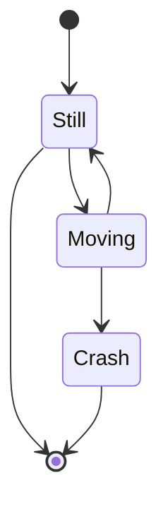

#  Design System Document | User Flow Audit Feature

## Overview 

This document describes the User Flow Audit feature and how it is implemented across the monorepo. It covers both
high-level and low-level aspects of the feature and outlines the architectural choices involved.

**Feature Name:** User Flow Audit
**Author:** Christopher Holder

## Purpose & Goals

**Problem Statement**

There are many tools available that measure the performance of an application, such as PageSpeed Insights. Most of these
tools use Lighthouse under the hood to evaluate performance. However, Lighthouse has an additional API called UserFlow, 
which can be used to test not only the initial navigation but also interactions within the application. Despite its 
usefulness, none of the existing tools seem to leverage this API.

Currently, developers can run UserFlow tests locally, but the results are unreliable due to inconsistencies between 
runs. This fluctuation in values reduces the usefulness of the test results, making it difficult to derive meaningful 
insights from them.

**Objectives**

TODO explain that the objective is to be able to do page-speed insights but for user-flows

**Success Metrics**

TODO figure this one out!

## Requirements

**Functional Requirements**

Users should be able to schedule an audit within the web application, receive results, and subscribe to notifications or
updates on the audit process. This includes tracking how many audits are queued before their audit is processed. This 
feature ensures that audits are processed efficiently while maintaining a clear separation of concerns between different
system components.

**Non-Functional Requirements**

**Constraints & Assumptions**

## High-level Design

This monorepo follows the NX apps and libs structure.
```
├──└──│

├── apps
│   ├── api
│   ├── portal
│   └── runner
```


TODO 



## Low-level Design

TODO

## Error handling & logging

TODO

## Security Considerations

TODO

## Performance & Scalability

TODO

## Deployment Strategy

## Open Questions and trade-offs

## References

## Conductor

### Requirements

The client needs to be able to request an audit. 

The client needs to be able to receive updates about the state of the audit

The client needs to be able to view the results

The server needs to be able to delegate the audit to a runner

The server needs to be able to update the client when there is a status change on the audit

The server needs to be able to store the results of the audit

The server needs to be able to be notified when the status of the audit has changed

The client should never talk to the runner directly

### Schedule Audit Request

The client should be able to schedule an audit. for this we can use an endpoint on the api/conductor feature lib.

This should be a POST request which passes the audit request in the body.

The post request should validate the audit details uses the correct schema.

If it does not contain the correct schema it should return an error message to the use that allows them to fix the error.

Else it should add the audit to an audit queue and return the ID of the audit generated by the queue.

### Audit Results Request

The client can request the results of an audit using an audit ID.

The server should check if the audit is still in the queue
    - If the audit is in the queue it should return a response stating it's still queued and its status.
    - The client should then subscribe for updates on the audit status.

If the audit is not in the queue the server should check the audit results exist and respond with the results
    - If the audit results do not exist it would respond with the appropriate http code.

### Audit QUEUE

The queue contains the following functionality

#### Queue audit
Assigns a unique ID to the audit
Marks the audit as queue.
Adding an item into the queue should notify a runner manager that it's been added.
Return a unique ID for the audit.

#### Next Queued Audit
It should get the next audit that should be process.
It should make the audit status as processing.
It should notify any listeners that the audit is being processed.
it should return the audit details.

#### Dequeue Audit
It should get the audit from an ID.
It should validate that it has a processing status.
It should remove the audit details.
It should return true.

#### Notify changes
It should register a callback run any time there are changes

#### Audits queued before audit by ID
It should return the number of audits queued before an audit from an ID.

### Audit Status Update

The client can subscribe to updates on an audit and its status this is done via a websocket connection.
