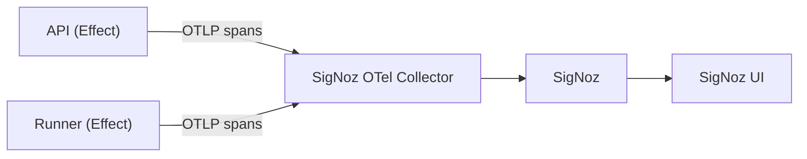

# Backend Observability (Effect + OpenTelemetry)

Status: Active
Owner: Christopher Holder
Last Updated: 2026-03-27

## Scope

Backend services only: `apps/api` and `apps/runner`.
All instrumentation is manual and implemented with Effect.

## Goals

- Provide traces for audit scheduling, runner lifecycle, and external calls.
- Keep everything open source and local-first.
- Make local setup simple: start SigNoz and run the app.
- Avoid auto-instrumentation and rely on Effect spans only.

## Non-Goals

- Frontend or browser tracing.
- Full logs and metrics pipelines in this phase.
- Production retention and sampling policies.

## Architecture (High Level)

Effect services emit spans via OTLP to a local SigNoz collector.

## Local Development Setup

- Run SigNoz locally with Docker Compose via Nx targets on the `observability` project.
- Expose ports 8080 (UI), 4317 (OTLP gRPC), 4318 (OTLP HTTP).
- Data is persisted in Docker volumes.
- Point the backend OTLP exporter to `http://localhost:4318`.
- SigNoz deployment files are vendored in `tools/observability/signoz` from the official SigNoz `deploy` folder.

### Commands

- Start SigNoz: `pnpm exec nx run observability:up`
- Check status: `pnpm exec nx run observability:status`
- Stream logs: `pnpm exec nx run observability:logs`
- Stop SigNoz: `pnpm exec nx run observability:down`
- Stop and delete SigNoz volumes: `pnpm exec nx run observability:reset`

### Backend Tracer Wiring

- Shared tracer factory: `libs/platform/observability/src/node-sdk.ts`
- API wiring: `apps/api/src/main.ts`
- Runner wiring: `apps/runner/src/bin.ts`
- Both apps export traces to `OTEL_EXPORTER_OTLP_ENDPOINT` (default: `http://localhost:4318`).
- API Docker image defaults `OTEL_EXPORTER_OTLP_ENDPOINT` to `http://host.docker.internal:4318`.
- Service names default to `api` and `runner` and can be overridden with `OTEL_SERVICE_NAME`.
- Sampling is configured as always-on locally.

## Instrumentation Plan (Effect Only)

- Use `@effect/opentelemetry` with the Node SDK and an OTLP trace exporter.
- Configure `service.name` per app, such as `api` and `runner`.
- Add spans at key boundaries.
- Key boundaries include HTTP request entry and route handlers.
- Key boundaries include runner claim, start, complete, and heartbeat.
- Key boundaries include DB transactions: claim, update status, and store results.
- Key boundaries include external calls: Lighthouse and outbound HTTP.
- Attach attributes: route, method, status, auditId, runId, runnerId, error name.

## Implemented Span Taxonomy

The current implementation uses explicit span names at each instrumentation callsite (`Effect.fn` / `Effect.withSpan`).

### API

- `api.health.get`
- `api.audit.schedule`
- `api.audit.findById`
- `api.audit.listRuns`
- `api.audit.runById`
- `api.audit.resultById`
- `api.audit.reportById`
- `api.audit.watchById`
- `api.audit.watchById.tick`
- `api.runner.claim`
- `api.runner.complete`
- `api.runner.heartbeat`
- `api.runner.shutdown`

### Runner Manager

- `runner.manager.ensureActive`
- `runner.manager.startProcess`
- `runner.manager.listActive`
- `runner.manager.terminate`

### Database

- `db.auditTemplate.create`
- `db.auditTemplate.getById`
- `db.auditRun.create`
- `db.auditRun.claimNext`
- `db.auditRun.hasScheduledRuns`
- `db.auditRun.markInProgress`
- `db.auditRun.getQueuePosition`
- `db.auditRun.getSummaryById`
- `db.auditRun.listPage`
- `db.auditRun.complete`
- `db.auditRun.getById`
- `db.auditResult.getByRunId`

### Runner Queue + Execution

- `runner.queue.claimNext`
- `runner.queue.completeRun`
- `runner.queue.heartbeat`
- `runner.queue.shutdownRequest`
- `runner.queue.terminate`
- `runner.queue.selfTerminateEc2`
- `runner.queue.loop`
- `runner.queue.processItem`
- `runner.queue.runtime`
- `runner.audit.process`
- `runner.audit.decodeScript`
- `runner.audit.acquireContext`
- `runner.audit.startFlow`
- `runner.audit.executeReplay`
- `runner.audit.createFlowResult`
- `runner.audit.createReportHtml`
- `runner.cli.execute`

### Runner Lifecycle + Reaper

- `runner.reaper.tick`
- `runner.lifecycle.reconcile`
- `runner.lifecycle.requestActivation`
- `runner.lifecycle.requestInactivation`

`api.audit.watchById` is a long-lived stream span, and `api.audit.watchById.tick` is emitted for each poll tick.

## Trace Context

- Propagate trace context across fibers using Effect span APIs.
- Include trace ids in structured logs and SSE events.

## Sampling

- Local: 100% sampling.
- Later: reduce sampling with head-based sampling or a collector.

## Viewing Traces

- Open the SigNoz UI at `http://localhost:8080`.
- Go to **APM > Traces**.
- Filter by service name (`api` or `runner`) and operation to validate spans.

## Future Extensions

- Tune collector pipelines for tail-sampling and multi-destination export.
- Add dashboards and alerting in SigNoz after trace coverage is complete.
