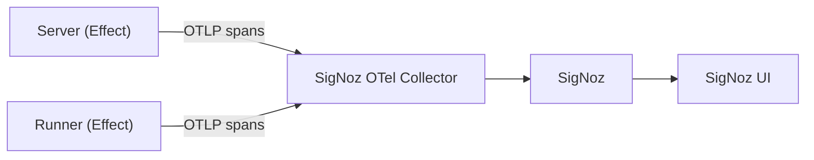

# Backend Observability (Effect + OpenTelemetry)

Status: Draft
Owner: Christopher Holder
Last Updated: 2026-02-11

## Scope
Backend services only: `apps/server` and `apps/runner`.
All instrumentation is manual and implemented with Effect.

## Goals
- Provide traces for audit scheduling, runner lifecycle, and external calls.
- Keep everything open source and local-first.
- Make local setup simple: start SigNoz and run the app.
- Avoid auto-instrumentation and rely on Effect spans only.

## Non-Goals
- Frontend or browser tracing.
- Full logs and metrics pipelines in this phase.
- Production retention and sampling policies.

## Architecture (High Level)
Effect services emit spans via OTLP to a local SigNoz collector.

## Local Development Setup
- Run SigNoz locally with Docker Compose via Nx targets on the `observability` project.
- Expose ports 8080 (UI), 4317 (OTLP gRPC), 4318 (OTLP HTTP).
- Data is persisted in Docker volumes.
- Point the backend OTLP exporter to `http://localhost:4318`.
- SigNoz deployment files are vendored in `tools/observability/signoz` from the official SigNoz `deploy` folder.

### Commands
- Start SigNoz: `npx nx run observability:up`
- Check status: `npx nx run observability:status`
- Stream logs: `npx nx run observability:logs`
- Stop SigNoz: `npx nx run observability:down`
- Stop and delete SigNoz volumes: `npx nx run observability:reset`

### Backend Tracer Wiring
- Server tracer layer: `apps/server/src/Observability.ts`
- Runner tracer layer: `apps/runner/src/Observability.ts`
- Both apps export traces to `OTEL_EXPORTER_OTLP_ENDPOINT` (default: `http://localhost:4318`).
- Server Docker image defaults `OTEL_EXPORTER_OTLP_ENDPOINT` to `http://host.docker.internal:4318`.
- Service names default to `server` and `runner` and can be overridden with `OTEL_SERVICE_NAME`.
- Sampling is configured as always-on locally.

## Instrumentation Plan (Effect Only)
- Use `@effect/opentelemetry` with the Node SDK and an OTLP trace exporter.
- Configure `service.name` per app, such as `server` and `runner`.
- Add spans at key boundaries.
- Key boundaries include HTTP request entry and route handlers.
- Key boundaries include runner claim, start, complete, and heartbeat.
- Key boundaries include DB transactions: claim, update status, and store results.
- Key boundaries include external calls: Lighthouse and outbound HTTP.
- Attach attributes: route, method, status, auditId, runId, runnerId, error name.

## Trace Context
- Propagate trace context across fibers using Effect span APIs.
- Include trace ids in structured logs and SSE events.

## Sampling
- Local: 100% sampling.
- Later: reduce sampling with head-based sampling or a collector.

## Viewing Traces
- Open the SigNoz UI at `http://localhost:8080`.
- Go to **APM > Traces**.
- Filter by service name (`server` or `runner`) and operation to validate spans.

## Future Extensions
- Tune collector pipelines for tail-sampling and multi-destination export.
- Add dashboards and alerting in SigNoz after trace coverage is complete.
